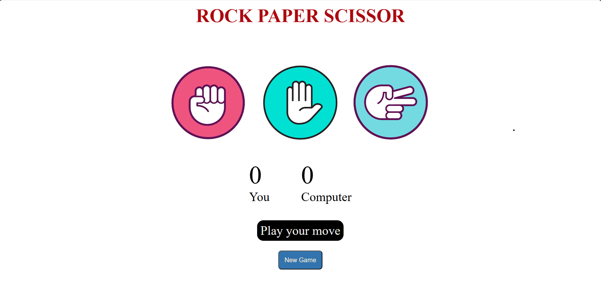

# 🪨📄✂️ Rock Paper Scissors Game

A fun and interactive **Rock Paper Scissors** (Stone Paper Scissors) game built using **HTML**, **CSS**, and **JavaScript**. Play against the computer, enjoy animations, and be the first to score 5 points!

---

## 🚀 Live Demo

🔗 [Click here to play the game](https://isha1shah.github.io/rock-paper-scissors)

---

## 🎮 Features

- 🧠 Player vs Computer mode  
- 🧮 Score tracking (First to 5 wins)  
- 🎉 Celebration with emoji effects on win  
- 🖥️ Responsive design for all devices  

---

## 📸 Screenshot




---

## 🛠️ Technologies Used

- **HTML5**
- **CSS3** (Animations, transitions)
- **JavaScript** (DOM manipulation, game logic)

---

## 🧑‍💻 Run Locally

To run the game locally on your system:

```bash
# Clone the repository
git clone https://github.com/isha1shah/rock-paper-scissors.git

# Go to the project directory
cd rock-paper-scissors

# Open index file in your browser
